# Flux Blocks


Three native Gutenberg blocks for showcasing content: a filterable **Query Grid**, a magazine-style **Content Showcase**, and a dismissible **Notification Banner** -- built entirely on the block editor, no separate page-builder layer.


## Why this plugin?

- **No separate builder layer** -- everything is a native block, edited with the block editor you already use.
- **Works with any post type** -- Posts, Pages, or any custom post type registered on your site, chosen right from the block's own settings.
- **Real interactivity, no jQuery** -- search, filtering, pagination, carousels, and image hotspots run on WordPress's own Interactivity API. No extra JS framework shipped to the frontend.
- **SEO-friendly pagination** -- Query Grid's numbered pagination is real, crawlable `<a href>` links with a configurable URL segment, not JS-only buttons.
- **Cache-aware by design** -- every query is cached and automatically invalidated the moment a post, category, or tag changes.
- **Clean uninstall** -- deleting the plugin removes every option and cached value it created.

## Blocks

### Query Grid

A filterable, paginated grid of posts.

- Four layouts as native Style Variations: Grid, List, Masonry, Carousel.
- Optional search bar and category/taxonomy filter pills.
- Optional sidebar layout for search + filters, either side.
- Numbered pagination or a "Load more" button.
- Responsive column counts (mobile/tablet/desktop), full color + font controls pulled from your active theme.

### Content Showcase

A magazine-style showcase of up to three posts, automatic or hand-picked.

- Four layouts as native Style Variations: Magazine, Split, Overlay, Two-Thirds/One-Third.
- Automatic mode (latest posts, optionally filtered) or manual mode (hand-pick each slot).
- Interactive image hotspots -- clickable pins with their own popover, title, text, and link.
- Optional "Explore More" CTA button.

### Notification Banner

A dismissible announcement bar or alert box.

- Four presets (Announcement, Info, Success, Warning) and five style variations (Gradient Background, Left Accent, Soft Card, Glassmorphism, Outline).
- Icon picker: emoji, dashicon, or a built-in SVG set.
- Dismiss button with optional "remember dismissal" (localStorage-backed).

## Screenshots

### Query Grid

| Grid, with numbered pagination | Carousel | Masonry |
|---|---|---|
| 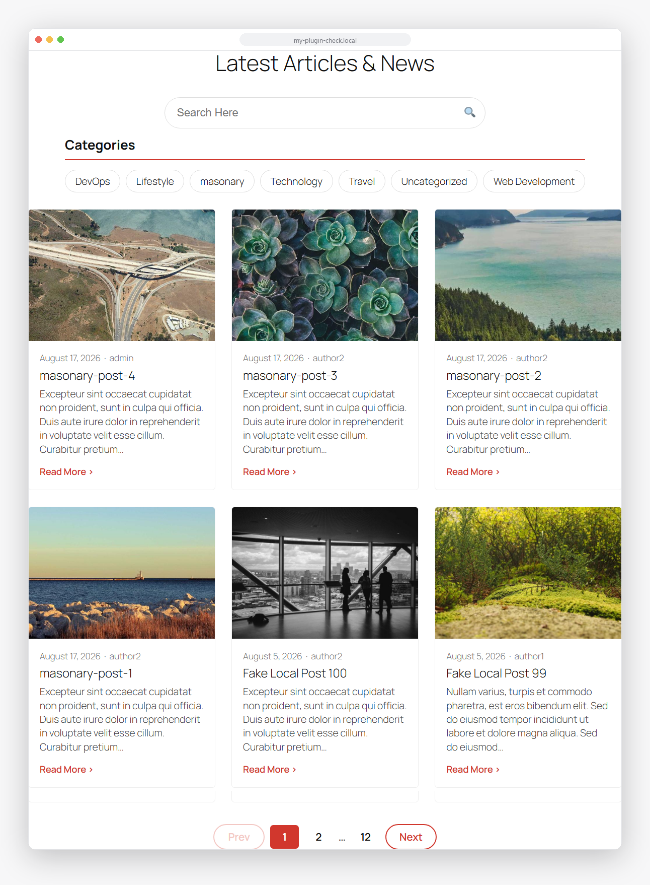 | 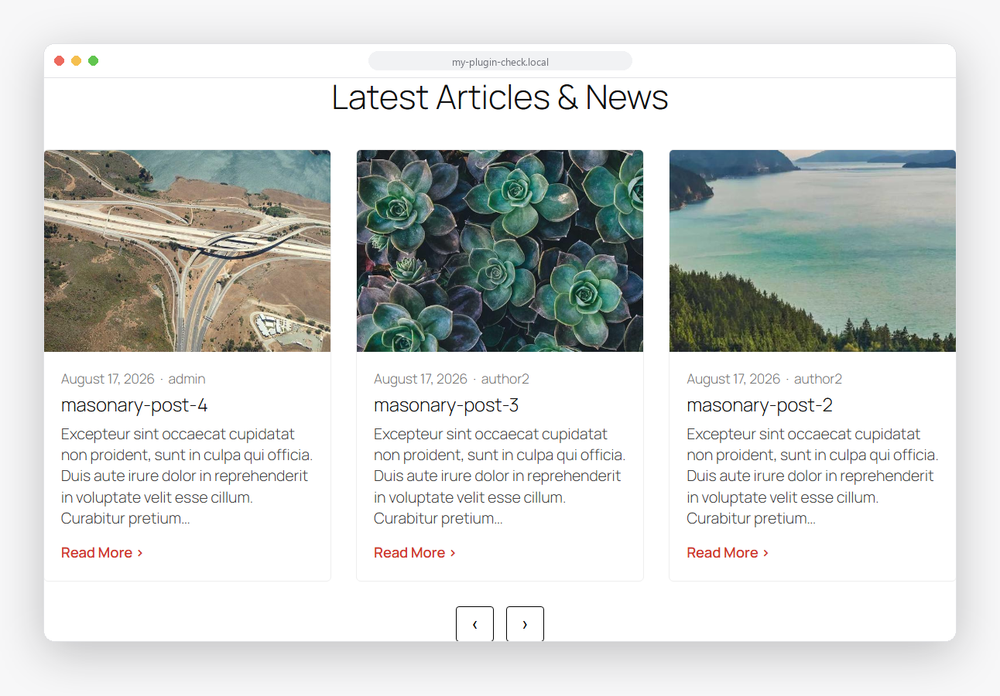 | 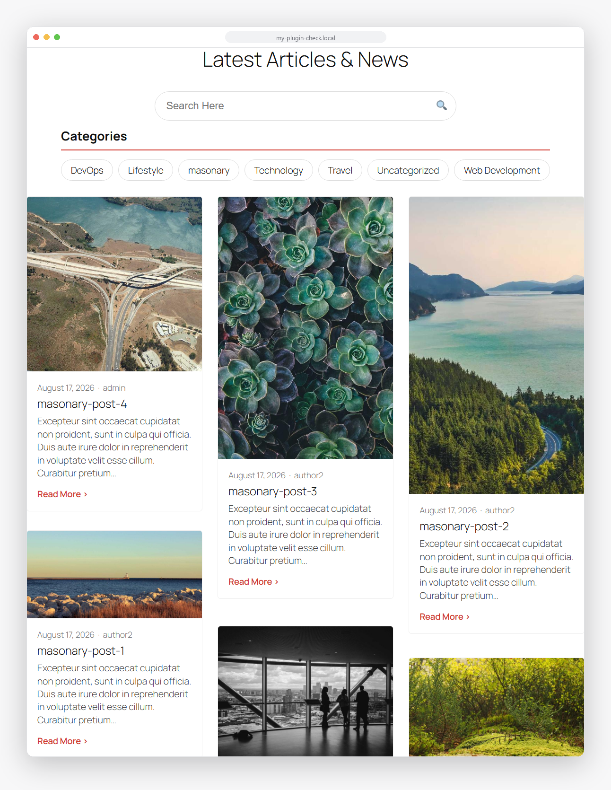 |

| List | Sidebar filters | Load more |
|---|---|---|
| 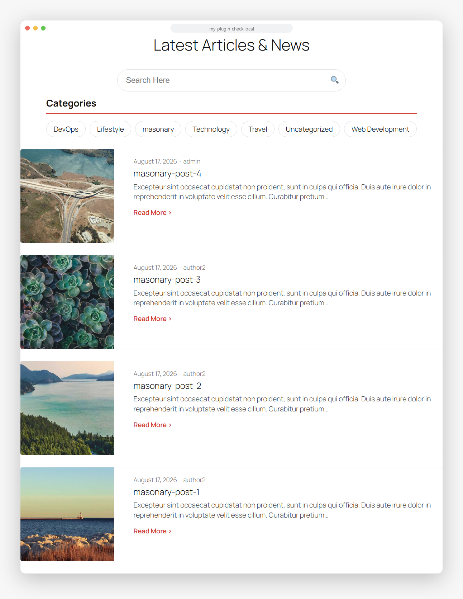 | 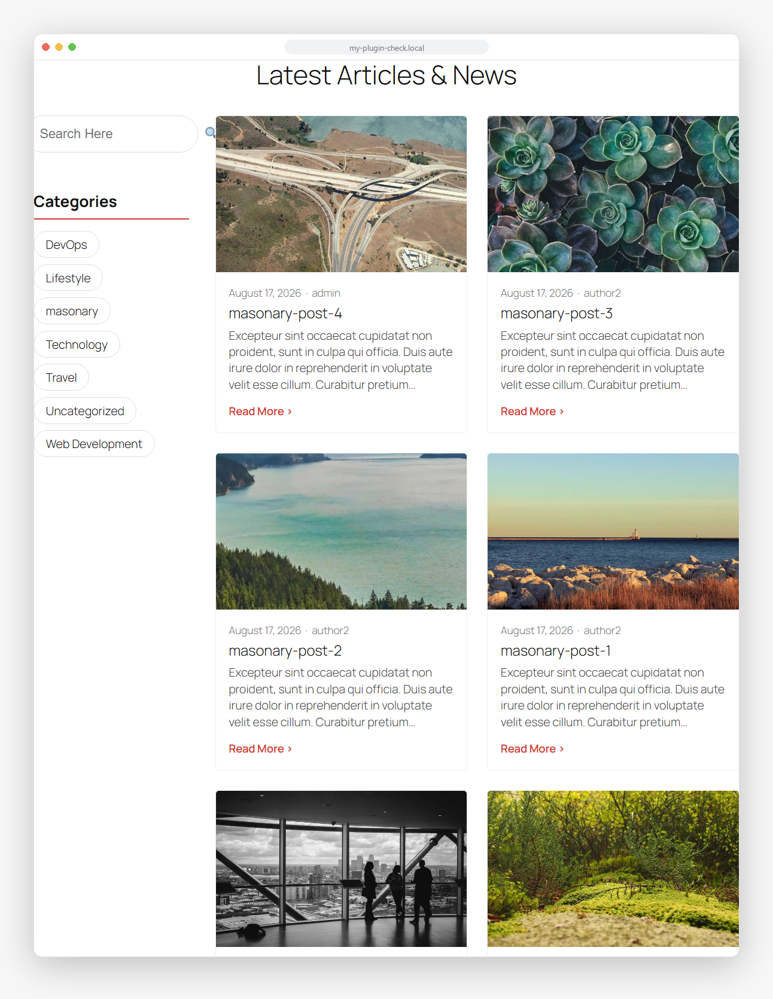 | 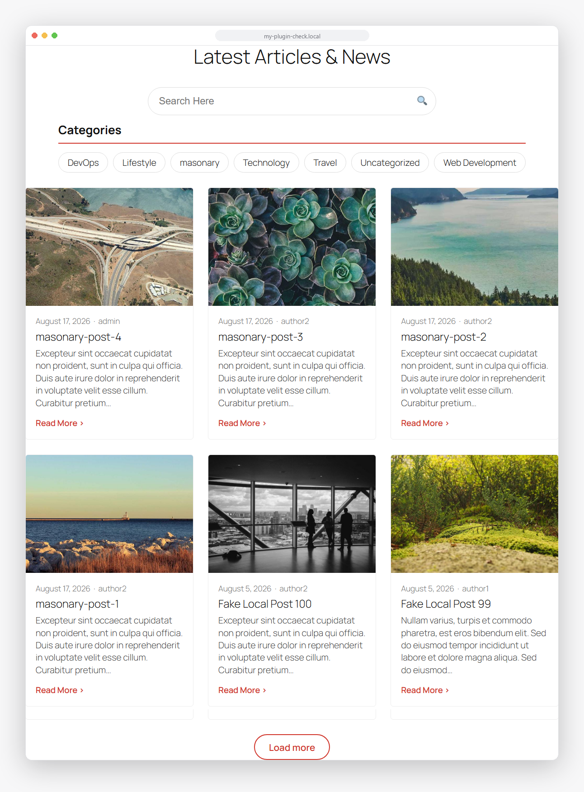 |

### Content Showcase

| Magazine | Split | Overlay |
|---|---|---|
| 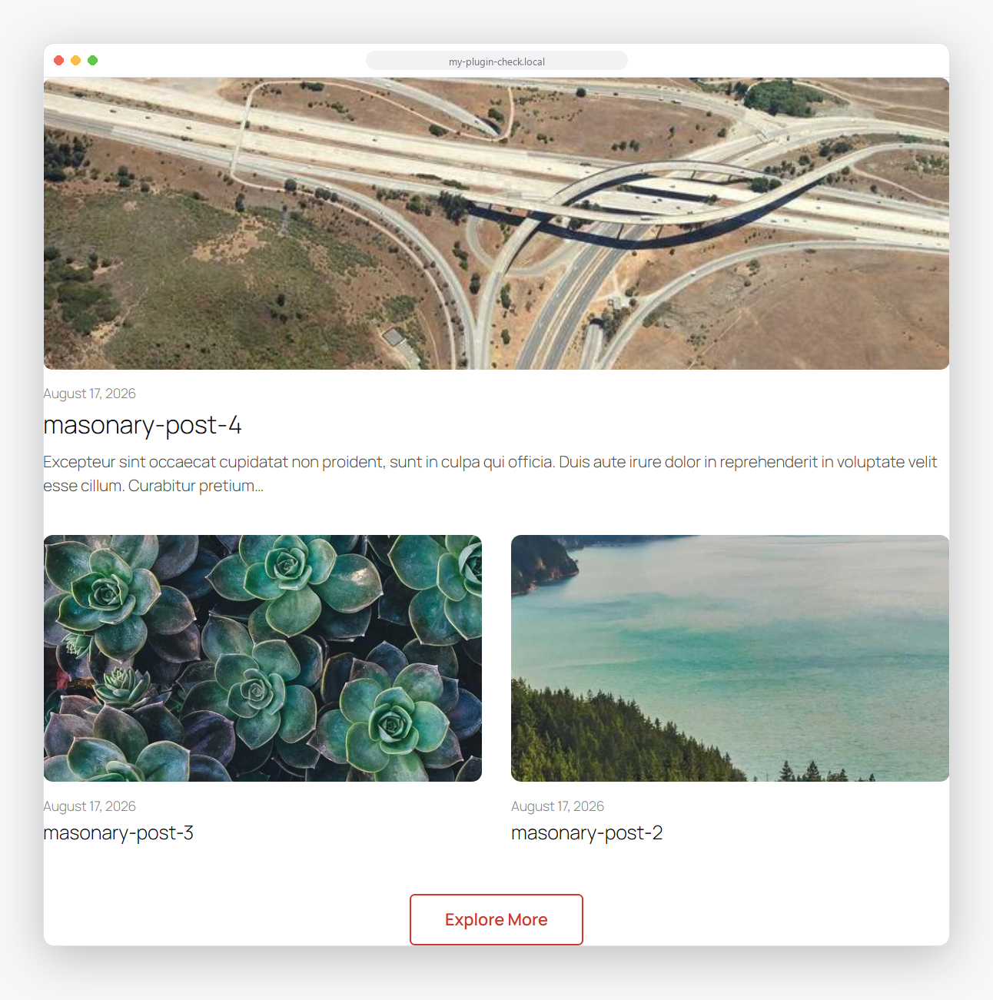 | 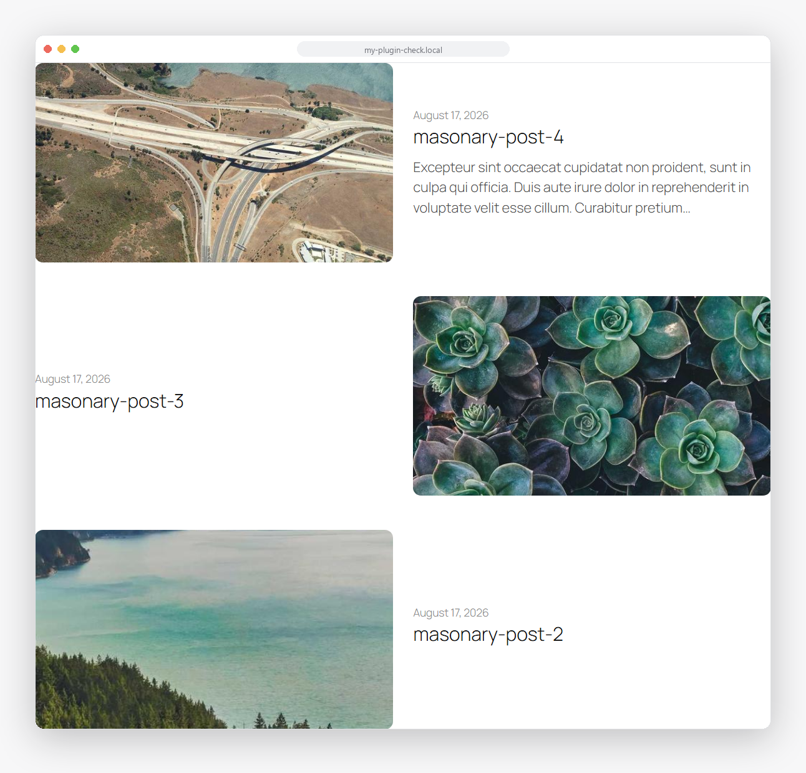 | 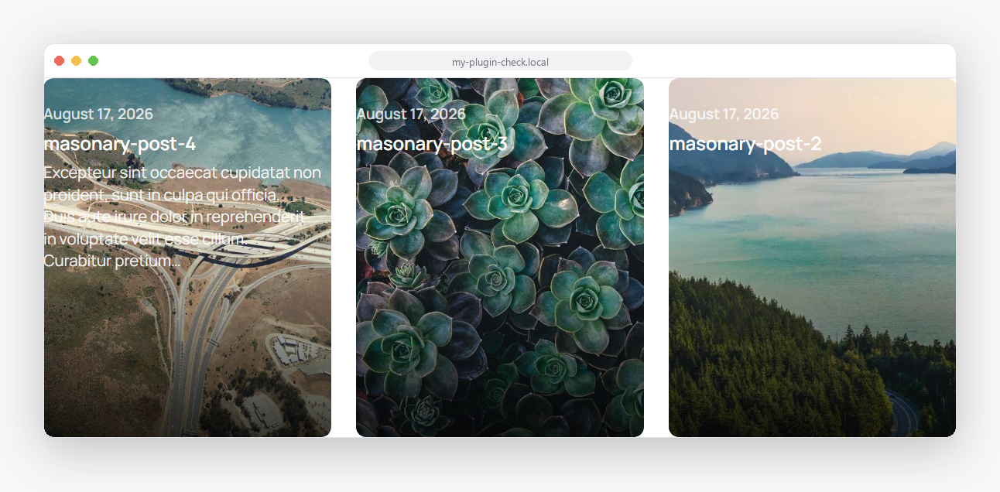 |

| Two-Thirds | Image hotspot popover |
|---|---|
| 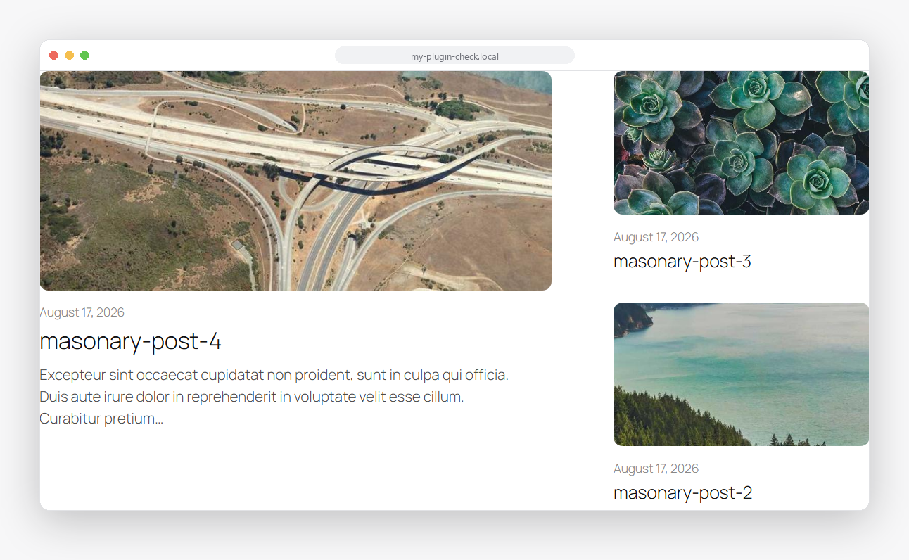 | 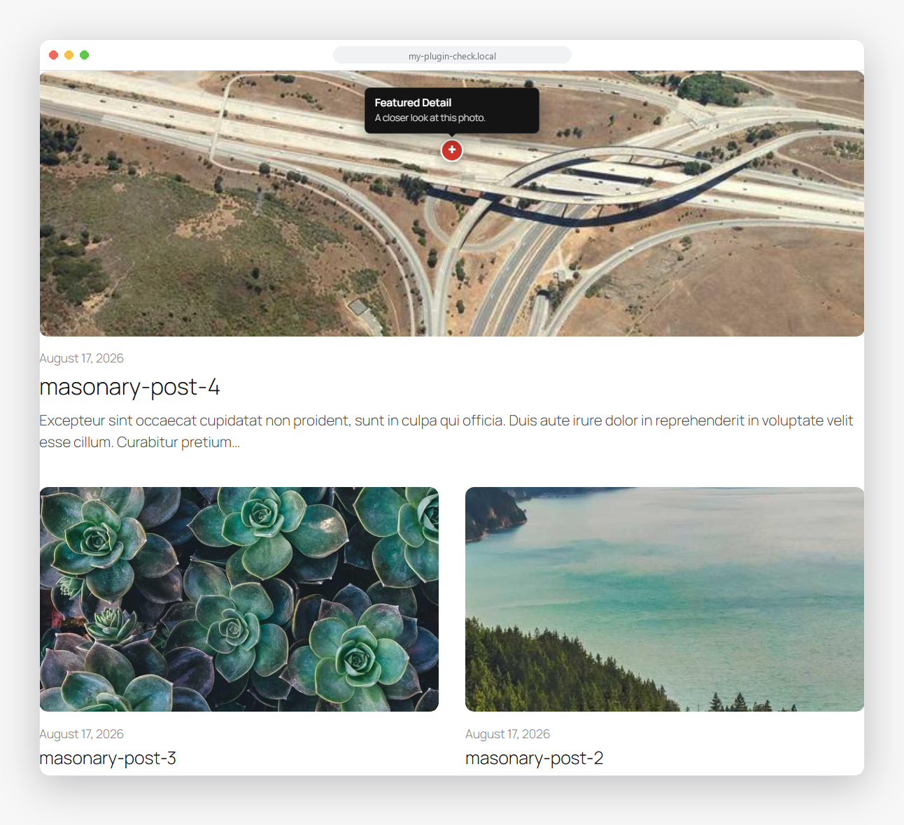 |

### Notification Banner

| Default | Warning + Glassmorphism | Success + Left Accent |
|---|---|---|
|  | 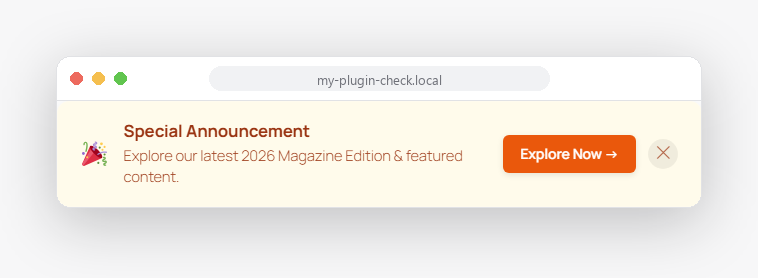 | 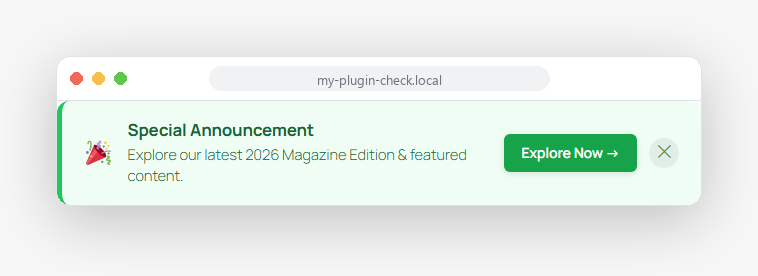 |

### Block editor

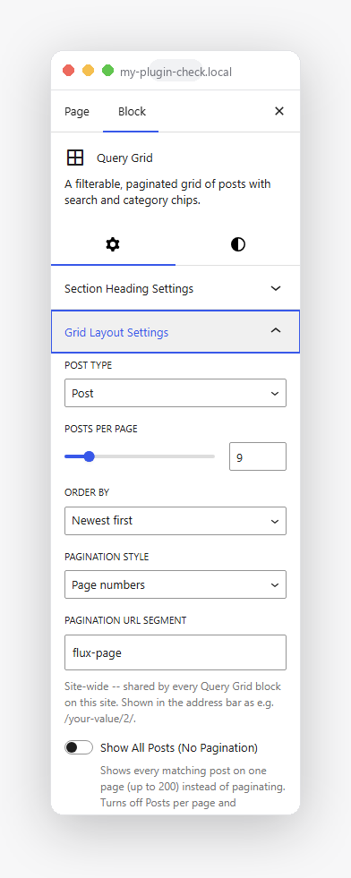

## Installation

1. Upload the plugin to `/wp-content/plugins/flux-blocks`, or install it through the WordPress Plugins screen.
2. Activate it through the Plugins screen.
3. Add a "Query Grid", "Content Showcase", or "Notification Banner" block from the "Flux Blocks" category in the inserter.

## Development

This repo is the plugin's source -- clone it into `wp-content/plugins/` of a WordPress install to work on it.

```bash
composer install       # PHP dependencies (autoloader, PHPUnit, PHPCS)
npm install             # JS dependencies (@wordpress/scripts)

npm run start            # dev build with watch mode
npm run build             # production build

composer lint              # PHPCS (WordPress Coding Standards)
composer test                # PHPUnit
npm run lint:js               # ESLint
npm run lint:css               # Stylelint
npm run test:unit:js            # Jest
```

### Architecture

- `includes/` -- PHP (PSR-4 autoloaded under the `FluxBlocks\` namespace). `Plugin::boot()` ([includes/Plugin.php](includes/Plugin.php)) is the composition root; `Services` ([includes/Services.php](includes/Services.php)) is the service container.
- `src/` -- block source (editor UI, frontend view scripts, styles). Built into `build/` via `@wordpress/scripts`.
- `tests/` -- PHPUnit (`tests/Unit/`) and Jest (`src/**/test/`) suites.
- Each block's render path: `src/<block>/render.php` -> `Services::<block>_renderer()` -> `includes/Blocks/<Block>/Render/Renderer.php`.

## License

GPL-2.0-or-later. See [LICENSE](https://www.gnu.org/licenses/gpl-2.0.html).
